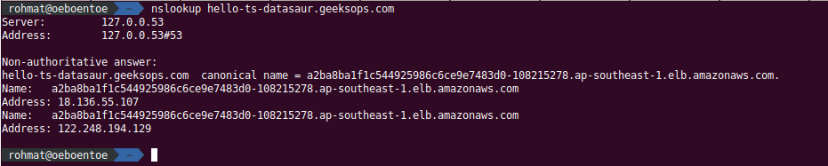
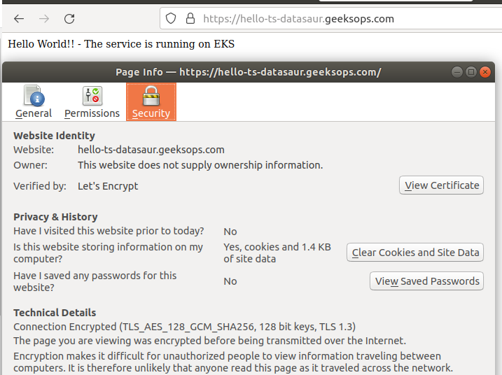
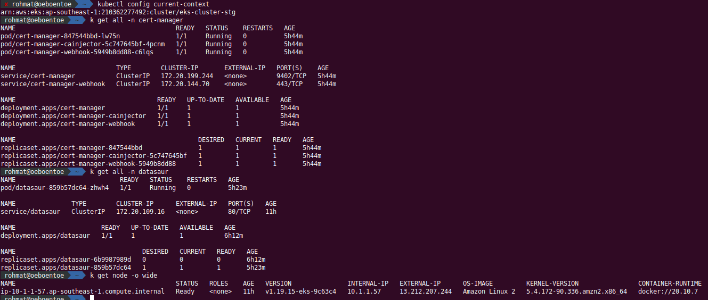

## Description 

Deployment services on EKS Cluster, including provisiong VPC, Security Group, IAM and EKS

## Components

* AWS : VPC, Security Grouup, IAM , EKS, Internet Gateway
* Ingress Controller : kong
* Certificate: cert-manager
* Infrastrutur as Code: Terraform

## Repository

* Infrastructure Repository: https://github.com/rotreein/ds-infra
* Service Repository: https://github.com/rotreein/typescript-starter/

## Provisioning
* Sample pipeline to provisioning EKS Cluster:  https://github.com/rotreein/ds-infra/runs/4995320735?check_suite_focus=true

## Deployment
* Sample pipeline deployment to EKS Cluster: https://github.com/rotreein/typescript-starter/actions/runs/1768672467

## How to Access hello world service
you can access via curl / browser. URL: https://hello-ts-datasaur.geeksops.com
* curl -v https://hello-ts-datasaur.geeksops.com

## Evidence

The DNS name hello-ts-datasaur.geeksops.com CNAME to ELB ( AWS )

 

Acces URL via browser

 

Sample resources deployment on EKS

